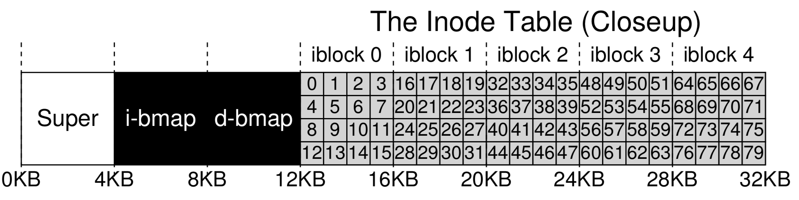

# File System Implementation

Caching and BufferingEXTENT-BASED APPROACHESvsfs\(the Very Simple File System\)

data structures & access methods

the region of the disk we use for user data is called **data region**


inode **存** metadata

To accommodate inodes, we’ll need to reserve some space on the disk for them as well. Let’s call this portion of the disk the inode table, which simply holds an array of on-disk inodes.


Our file system thus far has data blocks \(D\), and inodes \(I\)

still need some way to track whether inodes or data blocks are free or allocated: allocation structures

We instead choose a simple and popular structure known as a bitmap, one for the data region \(the data bitmap\), and one for the inode table \(the inode bitmap\). A bitmap is a simple structure: each bit is used to indicate whether the corresponding object/block is free \(0\) or in-use \(1\). And thus our new on-disk layout, with an inode bitmap \(i\) and a data bitmap \(d\): 


superblock\(S\): The superblock contains information about this particular file system, including, for example, how many inodes and data blocks are in the file system \(80 and 56, respectively in this instance\), where the inode table begins \(block 3\), and so forth. It will likely also include a magic number of some kind to identify the file system type \(in this case, vsfs\).


**File Organization: The Inode**

inode: short for index node

Each inode is implicitly referred to by a number \(called the i-number\), which we’ve earlier called the **low-level name** of the file.



To read inode number 32, the file system would first calculate the off-set into the inode region \(32 · sizeof\(inode\) or 8192\), add it to the start address of the inode table on disk \(inodeStartAddr = 12KB\), and thus arrive upon the correct byte address of the desired block of inodes: 20KB. Recall that disks are not byte addressable, but rather consist of a large number of addressable sectors, usually 512 bytes. Thus, to fetch the block of inodes that contains inode 32, the file system would issue a read to sec-tor 20×1024/512 , or 40, to fetch the desired inode block. More generally, the sector address sector of the inode block can be calculated as follows:

```text
blk = (inumber * sizeof(inode_t)) / blockSize;
sector = ((blk * blockSize) + inodeStartAddr) / sectorSize;
```


**The Multi-Level Index**

indirect pointer: Instead of pointing to a block that contains user data, it points to a block that contains more pointers, each of which point to user data.

An inode may have some fixed number of direct pointers \(e.g., 12\), and a single indirect pointer.

If a file grows large enough, an indirect block is allocated \(from the data-block region of the disk\), and the inode’s slot for an indirect pointer is set to point to it. Assuming 4-KB blocks and 4-byte disk addresses, that adds another 1024 pointers; the file can grow to be \(12 + 1024\) · 4K or 4144KB.

**EXTENT-BASED** APPROACHES: use extents instead of pointers

An extent is simply a disk pointer plus a length \(in blocks\); thus, instead of requiring a pointer for every block of a file, all one needs is a pointer and a length to specify the on-disk location of a file.

limiting: one may have trouble finding a contiguous chunk of on-disk free space when allocating a file.

they work well when there is enough free space on the disk and files can be laid out contiguously

dou- ble indirect pointer: This pointer refers to a block that contains pointers to indirect blocks, each of which contain pointers to data blocks. 1024 · 1024 or 1-million 4KB blocks

triple indirect pointer

twelve direct pointers, as well as both a single and a double indirect block. assume a block size of 4 KB: \(12 + 1024 + 10242\) × 4 KB

this imbalanced tree is referred to as the **multi-level index** ap- proach to pointing to file blocks.

**40.4 Directory Organization**

assume a directory dir \(inode number 5\) has three files in it \(foo, bar, and foobar is a pretty longname\), with inode num- bers 12, 13, and 24 respectively. The on-disk data for dir might look like:


each entry has an inode number, record length \(the total bytes for the name plus any left over space\), string length \(the actual length of the name\), and finally the name of the entry.

root directory：/. In most UNIX file systems, the root inode number is 2.

READS DON’T ACCESS ALLOCATION STRUCTURES\(bitmaps\):

Allocation structures, such as bitmaps, are only accessed when allocation is needed. The inodes, directories, and indirect blocks have all the information they need to complete a read re- quest; there is no need to make sure a block is allocated when the inode already points to it.

Writing A File To Disk

the file /foo/bar is created, and three blocks are written to it:


**40.7 Caching and Buffering**

dynamic partitioning

Now imagine the file open example with caching. The first open may generate a lot of I/O traffic to read in directory inode and data, but subsequent file opens of that same file \(or files in the same directory\) will mostly hit in the cache and thus no I/O is needed.

write buffering \(as it is sometimes called\) certainly has a number of per- formance benefits. First, by delaying writes, the file system can batch some updates into a smaller set of I/Os; for example, if an inode bitmap is updated when one file is created and then updated moments later as another file is created, the file system saves an I/O by delaying the write after the first update. Second, by buffering a number of writes in memory, the system can then schedule the subsequent I/Os and thus increase per- formance. Finally, some writes are avoided altogether by delaying them; for example, if an application creates a file and then deletes it, delaying the writes to reflect the file creation to disk avoids them entirely.


